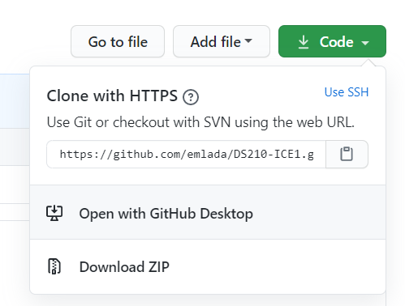
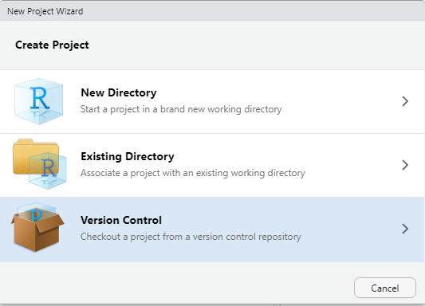
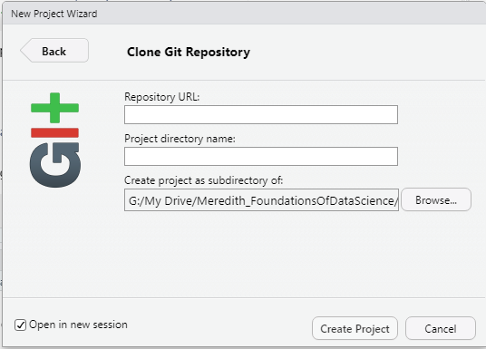
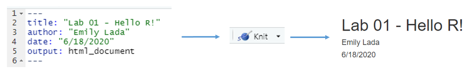
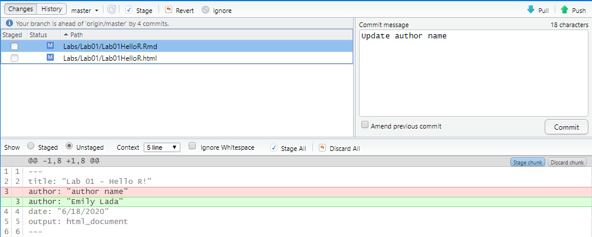

The main goal of this lab is to introduce you to R and RStudio, which we will be using throughout the course both to learn the statistical concepts discussed in the course and to analyze real data and come to informed conclusions. 


An additional goal is to introduce you to git and GitHub, which is the collaboration and version control system that we will be using throughout the course.

As the labs progress, you are encouraged to explore beyond what the labs dictate; a willingness to experiment will make you a much better programmer. Before we get to that stage, however, you need to build some basic fluency in R. Today we begin with the fundamental building blocks of R and RStudio: the interface, reading in data, and basic commands.

# Authentication

In this course, we will push and pull files from Github using HTTPS.  You will need to use a personal access token (PAT) as your credential for HTTPS operations.  Click on the link below to create your PAT.  You will need to be logged into your github account.  You can choose the expiration date to be whatever you like, but I suggest making it at least 5 months from today to last the duration of this class.  For the scope of the token, you can select all options to be safe.

[Create PAT in Github](https://docs.github.com/en/github/authenticating-to-github/keeping-your-account-and-data-secure/creating-a-personal-access-token)


# Getting started

Each of your assignments will begin with the following steps. You can always refer back to this lab for a detailed list of the steps for getting started with any assignment.


- Click on the assignment link that you should have received in your email to create your GitHub repository (which we'll refer to as "repo" going forward) for the assignment. This repo contains a template you can build on to complete your assignment.


```{r clone-repo-link, fig.margin = TRUE, echo = FALSE, fig.width=3}

```

- On GitHub, click on the green **Code** button, select **Use HTTPS** (this might already be selected by default, and if it is, you'll see the text **Clone with HTTPS** as in the image below). Click on the clipboard icon to copy the repo URL.

```{r new-project-from-gh, fig.margin = TRUE, echo = FALSE, fig.width=3}

```

- Go to RStudio and select File $\rightarrow$ New Project $\rightarrow$ Version Control $\rightarrow$ Git.

```{r paste-gh-repo-url, fig.margin = TRUE, echo = FALSE, fig.width=5}

```
- Paste the URL of your assignment repo into the Repository URL field. 


- Give your project a name (like DS210_Lab01) in the Project Directory field.

- Choose a directory on your machine where the project will be saved.  It is a good idea to create a directory just for projects for this course.

- Click Create Project, and you're good to go!

# Housekeeping

```{r eval = FALSE}
Your email address is the address tied to your GitHub account and your name should be first and last name.
```

Before we can get started we need to take care of some required housekeeping. Specifically,  we need to configure your git so that RStudio can communicate with GitHub. This requires two pieces of information: your email address and your name.


To do so, follow these steps:

- Go to the *Terminal* pane (lower left in R Studio)
- Type the following two lines of code, replacing the information in the quotation marks with your info:

```{bash eval=FALSE}
git config --global user.email "your email"
git config --global user.name "your name"
```

For example, for me these are

```{bash eval=FALSE}
git config --global user.email "eklada@meredith.edu"
git config --global user.name "Emily Lada"
```

To confirm that the changes have been implemented, run the following

```{bash eval=FALSE}
git config --global user.email
git config --global user.name
```
# Packages

In this lab we will work with two packages: `datasauRus` which contains the dataset, and `tidyverse` which is a collection of packages for doing data analysis in a "tidy" way.

Install these packages by running the following in the console (if you have not installed them previously):

```{r eval = FALSE}
install.packages("tidyverse")
install.packages("datasauRus")
```

Now that the necessary packages are installed, you should be able to Knit your document and see the results.

# Warm up

Before we introduce the data, let's warm up with some simple exercises. 

## YAML: 

The top portion of your R Markdown file (between the three dashed lines) is called YAML. It is a human friendly data serialization standard for all
programming languages. All you need to know is that this area is called the
YAML and that it contains meta information about your document.

Open the R Markdown (Rmd) file in your project, change the author name and date, and knit the document.

```{r yaml-raw-to-rendered, fig.fullwidth=TRUE, echo = FALSE}

```

## Commiting changes:

Then go to the Git pane in your RStudio.

If you have made changes to your Rmd file, you should see it listed here. Click on it to select it in this list and then click on **Diff**. This shows you the *diff*erence between the last committed state of the document and its current state that includes your changes. If you're happy with these changes, check the "Staged" box for the Rmd file and the html file, write "Update author name" in the **Commit message** box and hit **Commit**.

```{r update-author-name-commit, fig.fullwidth=TRUE, echo = FALSE}

```

You don't have to commit after every change, this would get quite cumbersome. You should consider committing states that are *meaningful to you* for inspection, comparison, or restoration. In the first few assignments, you will be told exactly when to commit and in some cases, what commit message to use. As the semester progresses you will make these decisions.

## Pushing changes: 

Now that you have made an update and committed this change, it's time to push these changes to the web! Or more specifically, to your repo on GitHub. Why? So that others can see your changes. And by others, we mean the course instructor (your repos in this course are private to you and the instructor, only). 

In order to push your changes to GitHub, click on **Push**. 


# Packages

In this lab we will use the `tidyverse` and `datasauRus` packages. We can load 
them using the following:

```{r load-packages, message = FALSE}
library(tidyverse)
library(datasauRus)
```

# Data

The data frame we will be working with today is called `datasaurus_dozen` and it's in the `datasauRus` package. Actually, this single data frame contains 13 datasets, designed to show us  why data visualization is important and how summary statistics alone can be misleading. The different datasets are marked by the `dataset` variable.

To find out more about the dataset, type the following in your Console: `?datasaurus_dozen`. A question mark before the name of an object will always bring up its help file. This command must be run in the Console.

1. Based on the help file, how many rows and how many columns does the `datasaurus_dozen` file have? What are the variables included in the data frame? Add your responses to your lab report. When you're done, commit your changes with the commit message "Added answer for Exercise 1", and push.


The code below makes a *frequency table* of the dataset variable:

```{r}
datasaurus_dozen %>%
  count(dataset) %>%
  print(13)
```


The original Datasaurus (`dino`) was created by Alberto Cairo in [this great blog post](http://www.thefunctionalart.com/2016/08/download-datasaurus-never-trust-summary.html). The other Dozen were generated using simulated annealing and the process is described in the paper *Same Stats, Different Graphs: Generating Datasets with Varied Appearance and Identical Statistics* through Simulated Annealing by Justin Matejka and George Fitzmaurice. In the paper, the authors simulate a variety of datasets that have the same summary statistics as the Datasaurus dataset but have very different distributions.

# Data visualization and summary

2. Plot `y` vs. `x` for the `dino` dataset. Then, calculate the correlation coefficient between `x` and `y` for this dataset.

Below is the code you will need to complete this exercise. Basically, the answer is already given, but you need to successfully knit the Rmd document.  To display the graph and correlation in your Rmd document, remove the `eval = FALSE` option in each code chunk below.

Start with the `datasaurus_dozen` dataset and pipe it into the `filter` function to filter for observations where `dataset == "dino"`. Store the resulting filtered data frame as a new data frame called `dino_data`.

```{r eval = FALSE}
dino_data <- datasaurus_dozen %>%
  filter(dataset == "dino")
```

There is a lot going on here, so let's slow down and unpack it a bit. 

First, the pipe operator: `%>%`, takes what comes before it and sends it as the first argument to what comes after it. So here, we're saying `filter` the `datasaurus_dozen` data frame for observations where `dataset == "dino"`.

Second, the assignment operator: `<-`, assigns the name `dino_data` to the filtered data frame.

Next, we need to visualize these data. We will use the `ggplot` function for this. Its first argument is the data you're visualizing. Next we define the `aes`thetic mappings. In other words, the columns of the data that get mapped to certain aesthetic features of the plot, e.g. the `x` axis will represent the variable called `x` and the `y` axis will represent the variable called `y`. Then, we add another layer to this plot where we define which `geom`etric shapes we want to use to represent each observation in the data. In this case we want these to be points, so we will use `geom_point`.

```{r eval = FALSE, fig.fullwidth=TRUE}
ggplot(data = dino_data, mapping = aes(x = x, y = y)) +
  geom_point()
```

If this seems like a lot, it is. And you will learn about the philosophy of building data visualizations in layer in detail soon. For now, follow along with the code that is provided.

For the second part of this exercise, we need to calculate a summary statistic: the correlation coefficient. The correlation coefficient, often referred to as $r$ in statistics, measures the linear association between two variables. You will see that some of the pairs of variables we plot do not have a linear relationship between them. This is exactly why we want to visualize first: visualize to assess the form of the relationship, and calculate $r$ only if relevant. In this case, calculating a correlation coefficient really doesn't make sense since the relationship between `x` and `y` is definitely not linear -- it's dinosaurial!

But, for illustrative purposes, let's calculate the correlation coefficient between `x` and `y`:

```{r eval = FALSE}
dino_data %>%
  summarize(r = cor(x, y))
```

*This is a good place to pause, commit changes with the commit message "Added answer for Exercise 2", and push.*

3. Plot `y` vs. `x` for the `star` dataset. You can (and should) reuse code we introduced above.  Replace the dataset name with the desired dataset. Then, calculate the correlation coefficient between `x` and `y` for this dataset. How does this value compare to the `r` of `dino`?

*This is another good place to pause, commit changes with the commit message "Added answer for Exercise 3", and push.*

4. Plot `y` vs. `x` for the `circle` dataset. You can (and should) reuse code we introduced above.  Replace the dataset name with the desired dataset. Then, calculate the correlation coefficient between `x` and `y` for this dataset. How does this value compare to the `r` of `dino`?

*You should pause again, commit changes with the commit message "Added answer for Exercise 4", and push.*


5. Finally, let's plot all datasets at once. In order to do this we will make use of facetting.  To make the output appear in your knitted document, remove the `eval = FALSE` option in the code chunks below.

```{r all-viz,  eval = FALSE, fig.fullwidth=TRUE}
ggplot(datasaurus_dozen, aes(x = x, y = y, color = dataset))+
  geom_point()+
  facet_wrap(~ dataset, ncol = 3) +
  theme(legend.position = "none")
```

And we can use the `group_by` function to generate all the summary correlation coefficients.

```{r all-r, eval = FALSE}
datasaurus_dozen %>%
  group_by(dataset) %>%
  summarize(r = cor(x, y)) %>%
  print(13)
```
*You should pause again, commit changes with the commit message "Added answer for Exercise 5", and push.*

- **Resize your figures:** 

```{r fig-resize-global, fig.margin = TRUE, echo = FALSE, fig.width=3}
knitr::include_graphics("img/fig-resize-global.png")
```

Click on the gear icon in on top of the R Markdown document, and select "Output Options..." in the dropdown menu. In the pop up dialogue box go to the Figures tab and change the height and width of the figures, and hit OK when done. Then, knit your document and see how you like the new sizes. Change and knit again and again until you're happy with the figure sizes. Note that these values get saved in the YAML.


You can also use different figure sizes for different figures. To do so click on the gear icon within the chunk where you want to make a change. Changing the figure sizes will add new options to these chunks: `fig.width` and `fig.height`. You can change them by defining different values directly in your R Markdown document as well.


```{r fig-resize-local, fig.margin = TRUE, echo = FALSE, fig.width=3}
knitr::include_graphics("img/fig-resize-local.png")
```


- **Change the look of your report:** 

Once again click on the gear icon in on top of the R Markdown document, and select "Output Options..." in the dropdown menu. In the General tab of the pop up dialogue box try out different Syntax highlighting and theme options. Hit OK and knit your document to see how it looks. Play around with these until you're happy with the look.

```{r theme-highlight, fig.margin = TRUE, echo = FALSE, fig.width=3}
knitr::include_graphics("img/theme-highlight.png")
```


<br>


*Yay, you're done! Commit all remaining changes, use the commit message "Done with Lab 1!", and push. Before you wrap up the assignment, make sure all documents are updated on your GitHub repo.*